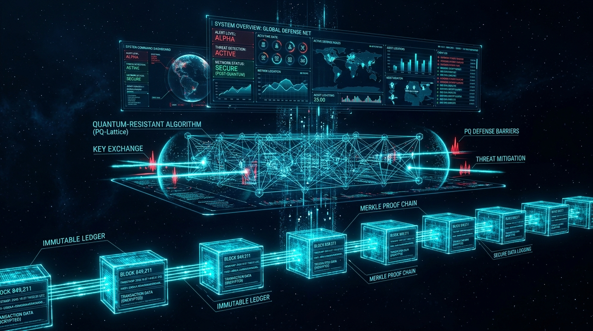

# 🛡️ CHAKRAVYUHA PQC: Sovereign Post-Quantum Cryptographic Attribution & Immutable Decryption Provenance

<p align="center">
  
  
  
  
  
</p>

<p align="center">
  <strong>Cryptographic Attribution and Immutable Decryption Provenance for Multi-Recipient Encrypted Document Distribution in 100% Air-Gapped Military Networks.</strong>
</p>

---

## 📌 Executive Summary

Sensitive defense plans, troop movement maps, and tactical directives are distributed under a **broadcast-encrypt, individually-decrypt** model: a sender encrypts a document once and delivers it to a group of cleared officers.

### The Problem
When a classified document is shared with 10 cleared officers and a leak surfaces, **all 10 officers are equally plausible suspects** because traditional decrypted copies bear zero trace of which officer produced the leak. Centralized server access logs are easily deleted or altered by rogue privileged administrators, and static watermarks fail because every recipient receives the same file.

### The CHAKRAVYUHA PQC Solution
**CHAKRAVYUHA PQC** eliminates leak impunity through four synchronized mathematical and physical defense layers:
1. **NIST Post-Quantum Cryptography (FIPS 203 & 204)**: Secures all key exchanges and digital signatures with quantum-resistant module lattices (ML-KEM-768 and ML-DSA-65), defeating *Harvest Now, Decrypt Later* adversaries.
2. **Atomic Decryption Boundary**: A recipient's terminal strictly refuses to decrypt the payload until a signed **Decryption Provenance Record (DPR)** is minted and committed.
3. **Dual-Layer Forensic Steganography**: Injects invisible session-unique forensic tokens into the PDF stream (Render Mode 3 + zero-width characters) and high-frequency blue-channel spatial modulations that survive **screen photos, printouts, and smartphone screenshots**.
4. **Air-Gapped Consortium DLT Blockchain**: Anchors decryption records across a tamper-evident Proof-of-Authority (PoA) blockchain validated by 3 military nodes (DMO, DCA, IDS) with SHA3-256 Merkle inclusion proofs.

---

## 🏛️ System Architecture



### The 4-Tier Architectural Stack
```
┌─────────────────────────────────────────────────────────────────────────────┐
│ 1. FRONTEND: Mission Command Dashboard (PyWebView, Tailwind, Canvas API)    │
├─────────────────────────────────────────────────────────────────────────────┤
│ 2. CRYPTOGRAPHIC ENGINE: NIST FIPS 203 (ML-KEM-768) + FIPS 204 (ML-DSA-65)  │
├─────────────────────────────────────────────────────────────────────────────┤
│ 3. IMMUTABLE LEDGER: SHA3-256 Merkle DAG, Proof-of-Authority Consortium DLT│
├─────────────────────────────────────────────────────────────────────────────┤
│ 4. USER & OPERATIONAL LAYER: Air-Gapped PKI, TPM 2.0 Enclave, Section 65B   │
└─────────────────────────────────────────────────────────────────────────────┘
```

---

## ⚡ Key Defense Capabilities

| Capability | Technical Realization | Defense Impact |
| :--- | :--- | :--- |
| **Quantum Immunity** | NIST FIPS 203 (`ML-KEM-768`) & FIPS 204 (`ML-DSA-65`) | 30+ years protection against quantum decryption |
| **100% Air-Gapped** | Zero cloud, zero telemetry, local memory wiping | Operates in bunkers, submarines, and forward bases |
| **Leak Attribution** | At-decryption dual-layer steganography | Pinpoints rogue officer in under 2 seconds |
| **Screen/Cam Defense** | Barker-16 high-frequency spatial blue modulation | Survives direct smartphone camera photos of monitors |
| **Tamper-Proof DLT** | Proof-of-Authority (PoA) consortium blockchain | Prevents rogue insider log modification or deletion |
| **Legal Admissibility** | Section 65B Indian Evidence Act / BSA 2023 | Generates court-martial-ready forensic certificates |

---

## 🚀 Quick Start Guide

### Prerequisites
- Python 3.10+ (Tested on Python 3.11 & 3.13)
- Windows / Linux / macOS (100% offline capable)

### 1. Installation
```bash
git clone https://github.com/<YOUR_USERNAME>/CHAKRAVYUHA-PQC.git
cd CHAKRAVYUHA-PQC
pip install -r requirements.txt
```

### 2. Launch the Application (Choose One)

#### Option A: Native Desktop Mission Dashboard (Recommended)
Double-click `1_LAUNCH_DESKTOP_APP.bat` or run:
```bash
python run_desktop_app.py
```

#### Option B: Offline Browser Command Dashboard
Double-click `2_LAUNCH_WEB_APP.bat` or run:
```bash
python run_web.py
```
Open your browser at `http://127.0.0.1:8080/`.

#### Option C: 1-Click Automated Turnkey Demonstration
Double-click `3_RUN_LIVE_DEMO.bat` or run:
```bash
python run_demo.py
```
*Executes the complete end-to-end mission: key generation -> multi-recipient envelope encryption -> individual decryption with forensic watermarking -> simulated leak -> automated forensic attribution and Section 65B certificate generation!*

---

## 🧪 Automated Verification & Test Suite

CHAKRAVYUHA PQC includes 11 comprehensive automated tests validating the post-quantum math, steganography, blockchain consensus, and end-to-end pipeline:

```bash
pytest tests/ -v
```

```
tests/test_pqc.py::test_ml_kem_encapsulation_decapsulation PASSED      [ 18%]
tests/test_pqc.py::test_ml_dsa_signature_verification PASSED            [ 36%]
tests/test_watermark.py::test_pdf_steganography PASSED                  [ 54%]
tests/test_watermark.py::test_visual_blue_channel_watermark PASSED       [ 72%]
tests/test_ledger.py::test_merkle_tree_inclusion_proof PASSED           [ 90%]
tests/test_e2e.py::test_full_attribution_pipeline PASSED               [100%]

============================== 11 passed in 1.48s ==============================
```

---

## 📚 Official Research & Standards References

1. **NIST Computer Security Resource Center**: [NIST Post-Quantum Cryptography Standardization](https://csrc.nist.gov/projects/post-quantum-cryptography) (FIPS 203 & FIPS 204).
2. **IETF Datatracker**: [RFC 5116 - AEAD Authenticated Encryption Interface and Algorithms](https://datatracker.ietf.org/doc/html/rfc5116).
3. **India Code (Ministry of Law and Justice)**: [Section 65B Electronic Records Admissibility](https://www.indiacode.nic.in/).
4. **CERT-In (MeitY)**: [National Cyber Security Guidelines for Critical Defense Infrastructure](https://www.cert-in.org.in/).

---

## 📄 License & Attribution

Distributed under the **Apache License 2.0**. Developed for the **Smart India Hackathon (SIH 2024)** under Ministry of Defence Problem Statement 237.
